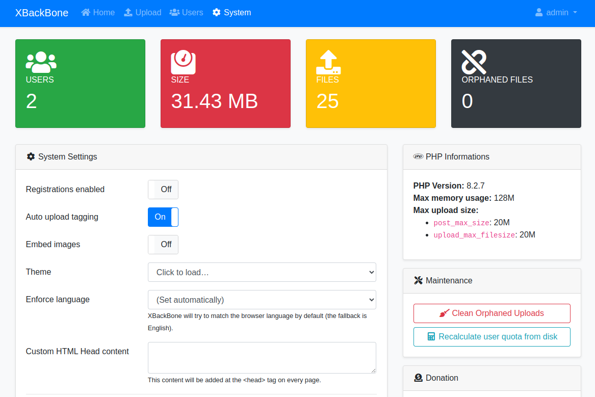

<!--
Este archivo README esta generado automaticamente<https://github.com/YunoHost/apps/tree/master/tools/readme_generator>
No se debe editar a mano.
-->

# XBackBone para Yunohost

[](https://dash.yunohost.org/appci/app/xbackbone)  

[](https://install-app.yunohost.org/?app=xbackbone)

*[Leer este README en otros idiomas.](./ALL_README.md)*

> *Este paquete le permite instalarXBackBone rapidamente y simplement en un servidor YunoHost.*  
> *Si no tiene YunoHost, visita [the guide](https://yunohost.org/install) para aprender como instalarla.*

## Descripción general

XBackBone is a simple and lightweight PHP file manager that support the instant sharing tool ShareX and NIX systems. It supports uploading and displaying images, GIF, video, code, formatted text, pdf, and file downloading and uploading. Also have a web UI with multi user management, media gallery and search support.


**Versión actual:** 3.7.0~ynh1

## Capturas



## Documentaciones y recursos

- Documentación administrador oficial: <https://xbackbone.app/>
- Repositorio del código fuente oficial de la aplicación : <https://github.com/SergiX44/XBackBone>
- Catálogo YunoHost: <https://apps.yunohost.org/app/xbackbone>
- Reportar un error: <https://github.com/YunoHost-Apps/xbackbone_ynh/issues>

## Información para desarrolladores

Por favor enviar sus correcciones a la [`branch testing`](https://github.com/YunoHost-Apps/xbackbone_ynh/tree/testing

Para probar la rama `testing`, sigue asÍ:

```bash
sudo yunohost app install https://github.com/YunoHost-Apps/xbackbone_ynh/tree/testing --debug
o
sudo yunohost app upgrade xbackbone -u https://github.com/YunoHost-Apps/xbackbone_ynh/tree/testing --debug
```

**Mas informaciones sobre el empaquetado de aplicaciones:** <https://yunohost.org/packaging_apps>
